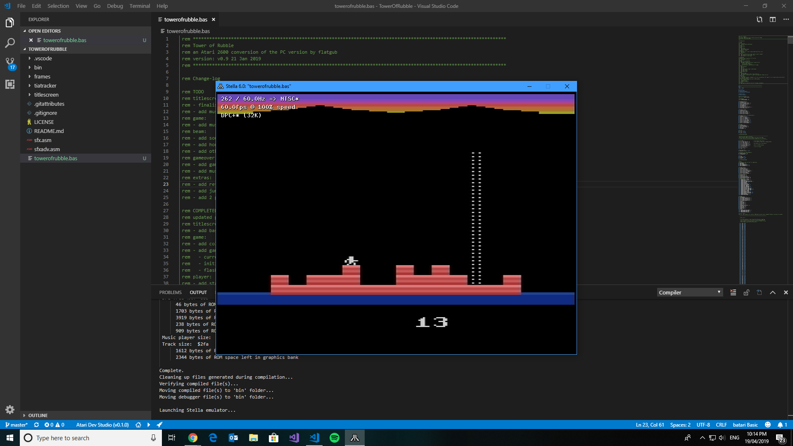
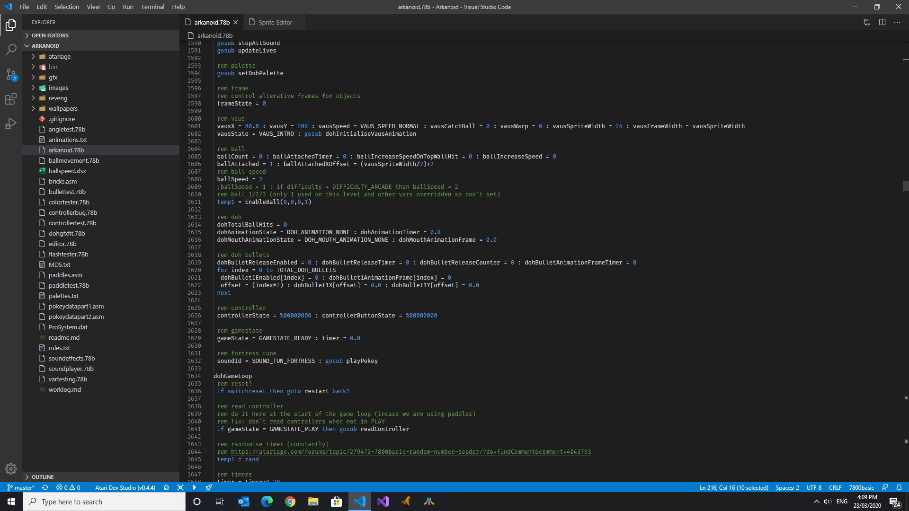
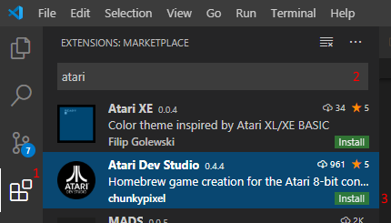
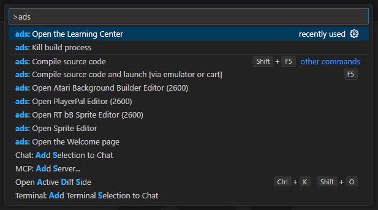
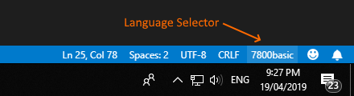
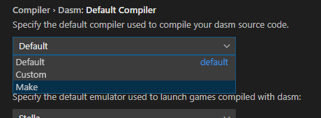
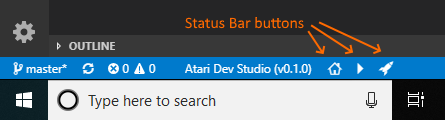
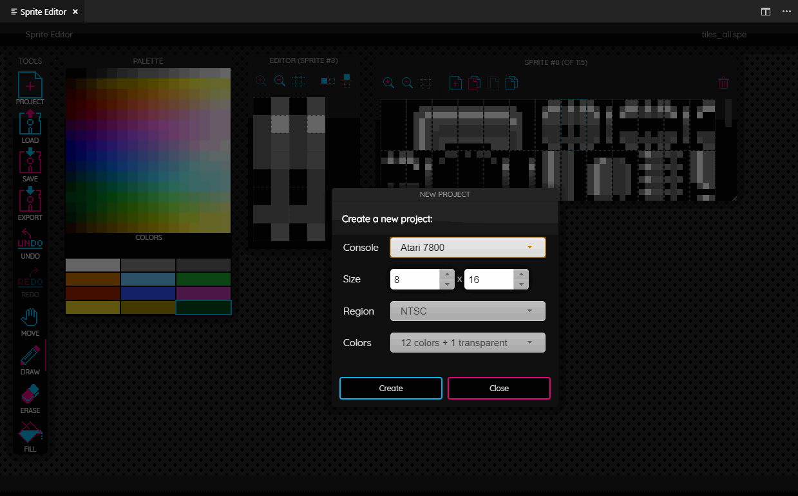
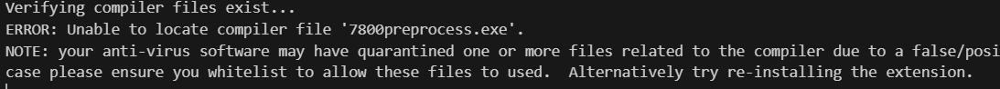

# Atari Dev Studio
Welcome to Atari Dev Studio for designing homebrew games for the Atari 8-bit systems (Atari 2600 and 7800). Atari Dev Studio is a one-stop-shop for any programmer and includes a number of built-in features to allow you to design, develop and test games for your favourite system. Get started with batari Basic (2600) or 7800basic (7800) using easy to learn BASIC-like languages or go hard-core with assembly using dasm.  During development test your creation using the Stella (2600) or A7800 (7800) emulators right from within Atari Dev Studio.

## Requirements
Atari Dev Studio is an extension for Microsoft's cross-platform IDE Visual Studio Code and will run on the Windows, Linux and macOS platforms. The latest releases of batari Basic, 7800basic, dasm, Stella and A7800 are included so you can begin coding straight after installing the extension. Though, please take a moment to check the OS-specific notes below for potential caveats.

## Features
Atari Dev Studio includes the following features:
* Develop your game on Windows, Linux or macOS
* Compile source code for your Atari 2600 or 7800 using batari Basic, 7800basic or dasm
* Use scripting (makefile, batch or shell script files) to build your dasm projects [preview]
* Optionally launch and test your game using the Stella (2600) or A7800 (7800) emulators
* Document outline support (batari basic, 7800basic, dasm)
* Peek/Go to Definition and Reference support (batari basic, 7800basic, dasm)
* Built-in Sprite Editor (also suitable for tiles and other objects) [preview]
* Manage your project using the File Explorer or version-control your source code directly with GitHub (and others) using the built-in features of the Visual Studio Code platform.
* Provide references to your own specific releases of each language or emulator rather than use the includes ones via the **Settings**.

Additional features are planned for the future. At this time the focus is on the core functionality and ensuring full cross-platform support.

## Installing Atari Dev Studio

### What is Visual Studio Code?
Visual Studio Code (VS Code) is a streamlined code editor with support for development operations like debugging, task running, and version control. It aims to provide just the tools a developer needs for a quick code-build-debug cycle and leaves more complex workflows to fuller featured IDEs, such as Visual Studio.

### Which OSs are supported?
VS Code is a cross-platform application which runs on Windows, Linux and macOS. See [requirements](https://code.visualstudio.com/docs/supporting/requirements) for the supported versions.

#### Windows
No special considerations. Windows users should be able to use Atari Dev Studio as is.

#### Linux
Linux users on 64-bit systems will be required to install the 32-bit compatibility libraries on your system to ensure everything will run as expected.

#### macOS
macOS users require a 64-bit operating system to fully utilise all features of Atari Dev Studio and will be required to install the SDL libraries on your system to ensure the A7800 emulator will run as expected.

Mac computers with [Apple silicon](https://support.apple.com/116943) currently have a few options:

1.  Thanks to Scott Lahteine (thinkyhead), Atari Dev Studio now includes `*.Darwin.arm64` (Apple silicon) binaries of relatively recent versions of bB, 7800basic, Stella and dasm.
    Note, these the are *not* the latest versions of these tools. See the atariage [discussion](https://atariage.com/forums/topic/333127-ataribasic-will-it-run-on-the-m1-mac)
    around additional issues you might encounter.
2.  Manually build `*.Darwin.arm64` (Apple silicon) binaries from source and configure Atari Dev Studio to use use your locally built binaries. See `README-macos.md` for instructions.
3.  Install and run the INTEL CHIP version of VS Code instead of the Apple Silicon version. This will cause Atari Dev Studio to use the Intel binaries, `*.Darwin.x86` / `*.Darwin.x64`.

Older Mac computers with Intel chips should be able to use Atari Dev Studio as is.

### Installing the extension
Once you have installed VS Code (available [here](https://code.visualstudio.com/Download)), open the VS Code program and complete the following:
1. From the **Activity Bar**, click the **Extensions** button to display the **Extensions** window.
2. From the **Extensions** window, type **Atari** into the **Search** box and press **Enter** to display the list of available extensions.
3. From the list of available extensions, locate **Atari Dev Studio** and click the green **Install** button.

### Updating the extension
Updates are regularly provided and you will be notified via VS Code when one has been made available. Once an update has been installed you will generally be prompted to restart VS Code.

## Using Atari Dev Studio

### Compiling your program
To display the available extension features press **CTRL+SHIFT+P** to display the **Command Palette**. From the **Command Palette** prompt type **ads** to short-list the available options:
* ads: Open the Welcome page
* ads: Compile source code (Shift+F5)
* ads: Compile source code and run in emulator (F5)
* ads: Kill build process
* ads: Open the Sprite Editor
* ads: Open PlayerPal 2600 Editor
* ads: Open Atari Background Builder 2600 Editor

### Language Selection
When you load a file the initial language will be chosen based on the file extension.  For example:
* batari Basic (.bas, .bb) [Default for .bas files]
* 7800basic (.bas, .78b)
* dasm (.dasm, .asm, .a, .h) 

To change a language you can click on the Status Bar **Language selector** and a list will be shown allowing you to choose another language. Optionally in the **Settings** you will be able to either let the extension choose based on the active language or set a specific language to always compile against.

### Build scripts [preview]
Prefer using scripts to build your dasm games? If you have chosen to override the dasm compiler (select Make via the **Settings**) , Atari Dev Studio will scan and detect for makefile, batch (makefile.bat) or shell scripts (makefile.sh) files which are located in your root workspace folder to build your game.

> Note: You are totally responsible to ensure your environment is properly configured to allow you to utilise the tools and applications you will be interacting with.  No support will be provided for this feature.
 
### Status Bar
Apart from using the **Command Palette** to select compilation, there are a number of short-cut buttons on the **Status Bar** allowing you to:
* Display the extension version (might be useful at times)
* Open Welcome page* Compile source code (Shift+F5)
* Compile source code and launch [via emulator or cart] (F5)
* Open Sprite Editor
* Open PlayerPal Editor (2600)
* Open Atari Background Builder Editor (2600)
* Open RT bB Sprite Editor (2600)

> Note: the short-cut buttons on the **Status Bar** can be minimised or turned off via the **Settings**.

### Sprite Editor [preview]
Atari Dev Studio includes a simple and easy to use Sprite Editor allowing you to create sprites, tiles and other objects for use in your projects.  It has the following features:
* New Project wizard allowing you to select the console (2600 or 7800), size, region (NTSC or PAL palettes) and total colors of your sprites
* Load and Save projects allowing you to save and come back to on-going work
* Editing features such as a pen, eraser, fill, line, rectangle and ellipse as well as zoom, move and palette selection
* Ability to manage your sprites in a sortable list with options to copy, paste, duplicate, resize and delete
* Load and save palettes
* Display a copyable list of color indexes for the selected sprite which can be used with your **incgraphics** references (7800)
* Export sprites to .png image files (7800)
* Create single or multi-color sprites (2600)
* Export sprites to batari Basic or assembly source code (2600)

The Sprite Editor is based on [Spritemate](http://spritemate.com) by Ingo Hinterding ([GitHub](https://github.com/Esshahn/spritemate)) and was suggested by RandomTerrain for inclusion in Atari Dev Studio. I have customised the source to provide the required features necessary for editing sprites, tiles and objects for the Atari platforms.  This work is currently in preview and will be on-going until all required features have been added.

### Settings
There are a number of compiler, emulator and editor configuration options available in Atari Dev Studio which can be changed via the **Settings** (Preferences -> Settings -> Extensions -> Atari Dev Studio).

### Recommended Setting changes
It is recommended to change these VSCode settings to the following as they appear to sometimes affect the ability of the internal save functions to automatically save your open documents before continuing with the compilation:

* Files: Auto Save - set to autoDelay (default is off)
* Files: Auto Save Delay - set to 0 (default is 1000)

NOTE: from version 0.97 onwards I have attempted to rectify this issue with an internal auto-retry function (will retry up to 5 times) when kicking off a compile.

### Debugging the extension
During the development phase of the extension I've added some developer output to assist with any issues that may appear.  To view this output, open the VS Code **Developer Tools** by selecting **Help -> Toggle Developer Tools** from the menu, and in the debugger window ensure the **Console** tab is activated.  This information may help identify the area where the extension is failing to process as expected.

## Known Issues
There are currently no known feature issues but if you find a problem please raise an issue on [GitHub](https://github.com/chunkypixel/atari-dev-studio/issues) or contact [mksmith](http://atariage.com/forums/user/66583-mksmith/) at the AtariAge community.

### Virus capture
On Windows when using the 7800basic or batari Basic compilers, occasionally some of the compile chain files are captured by virus protection software (eg. Windows Security) and quarantined. This is a false/positive case but you will need to release/restore these file(s) when required to allow the compilation to succeed. You should find a file verification error in the compile log identifying this potential capture:

If you have specific installed virus software consult your manual to release/restore the file(s).  Alternatively `Windows Security` will have captured the file(s).  Complete the following as required:

* **Windows 10** - Open `Settings`, select `Update & Security` then `Windows Security` from the sidebar.
* **Windows 11** - Open `Settings`, select `Privacy & Security` from the sidebar, then `Windows Security` from the list.

Locate the `Virus & threat protection` item and follow the prompts to release/restore the required file(s).

## Acknowlegments
This extension is only available due to the great people of the AtariAge community who have created these tools to help developers build their vision.  Special thanks to the following for either allowing the inclusion of their tools or for their ongoing help and encouragement:
* 7800basic - Mike Saarna (RevEng)
* batari Basic - Fred Quimby (batari) and Mike Saarna (RevEng)
* dasm - the many contibutors
* Stella emulator - Stephen Anthony (stephena)
* A7800 emulator - Mike Saarna (RevEng) and Robert Tuccitto (Trebor)
* PlayerPal 2600 and Atari Background Builder (kisrael)
* Mats Engstrom (SmallRoomLabs)
* Scott Lahteine (thinkyhead) for the MacOS ARM Compatibility for bB, 7800basic, Stella, dasm
* Fred Sauer (fredsa) for product suggestions and additional information relating to the MacOS ARM releases and self compilation of the language compilers. Learn more [here](README-macos.md).
* The AtariAge community including Albert, CPUWiz, Random Terrain, Trebor, Synthpopalooza, sramirez2008, Defender_2600, Gemintronic, Karl G, ZeroPage Homebrew, Muddyfunster, TwentySixHundred, Lillapojkenpåön, Andrew Davie, splendidnut, andyjp, sexyUnderwriter, MikeBrownEmplas, Generation2Games, cwieland, slacker, milnak

## Languages
Atari Dev Studio includes the following programming languages:

### batari Basic (release 1.8 - 20250615, macOS ARM64 release 1.6)
batari Basic created by Fred 'batari' Quimby is a BASIC-like language used in the creation of Atari 2600 games. batari Basic is compiled to generate a binary file that can by used on actual Atari 2600 VCS hardware via cartridge (such as a Harmony or UNO cart) or by using an Atari 2600 VCS emulator such as Stella.

batari Basic is an external project is kindly currently maintained by Mike Saarna (RevEng) and can be downloaded separately [here](https://github.com/batari-Basic/batari-Basic).  Further information is about this release is available here at [AtariAge](https://atariage.com/forums/topic/300856-official-home-for-batari-basic).

### 7800basic (release 0.36 - 20250615, macOS ARM64 release 0.29)
7800basic is a BASIC-like language for creating Atari 7800 games.  It is a compiled language that runs on a computer, and it creates a binary file that can be run with an Atari 7800 emulator, or the binary file may be used to make a cartridge that will operate on a real Atari 7800. 7800basic is derived from batari basic, a BASIC-like language for creating Atari 2600 games. Special thanks to the bB creator, Fred Quimby, and all of the the bB contributors!

7800basic is included as part of this extension with many thanks to Mike Saarna (RevEng).  7800basic is an external project and can be downloaded separately [here](https://github.com/7800-devtools/7800basic).  Further information about this release is available here at [AtariAge](http://atariage.com/forums/topic/222638-7800basic-beta-the-release-thread).

### dasm (release 2.20.14.1 - 20201109)
dasm is a versatile macro assembler with support for several 8-bit microprocessors including MOS 6502 & 6507, Motorola 6803, 68705 & 68HC11, Hitachi HD6303 (extended Motorola 6801), and Fairchild F8. Matthew Dillon started dasm in 1987-1988. Olaf 'Rhialto' Seibert extended dasm in 1995. dasm has also been maintained by Andrew Davie (2003-2008) and Peter Froehlich (2008-2015). The DASM team has taken over maintaining and updating dasm since 2019.

dasm is an external project and can be downloaded separately [here](https://dasm-assembler.github.io).

## Emulation
Atari Dev Studio includes the following emulators for testing purposes:

### Stella (release 7.0 - 20241006)
Stella is a multi-platform Atari 2600 VCS emulator released under the GNU General Public License (GPL). Stella was originally developed for Linux by Bradford W. Mott, and is currently maintained by Stephen Anthony. Since its original release several people have joined the development team to port Stella to other operating systems such as AcornOS, AmigaOS, DOS, FreeBSD, IRIX, Linux, OS/2, MacOS, Unix, and Windows. The development team is working hard to perfect the emulator and we hope you enjoy our effort.

Stella is included as part of this extension with many thanks to Stephen Anthony. Stella is an external project and can be downloaded separately [here](https://stella-emu.github.io). If you enjoy using Stella place consider [donating](https://stella-emu.github.io/donations.html) to ensure it's continued development.

> Note: Stella emulation in Atari Dev Studio is now fully 64-bit only.  If you wish to use an older 32-bit version, configure a custom path in the Settings instead (Emulator › Stella: Path).

### A7800 (release 5.2 - 20220626)
A7800 is a fork of the MAME Atari 7800 driver, with several enhancements added:
* Support for emulation of Proline Joysticks, VCS Joysticks, Lightguns, Paddles, Driving Controllers, Keypads, Trak-Balls, Amiga Mice, and ST Mice.
* Maria DMA timing has been improved further, with the addition of accurate DMA hole penalties.
* Selectable and improved palettes with enhanced screen options.
* Streamlined UI including menu options to have an Atari 7800 system focus.
* A bug in the existing RIOT emulation has been fixed.
* POKEY sound emulation improvements.
* SALLY (CPU) and MARIA (Graphics chip) performance adjustments.
* Audio indication of no ROM loaded silenced.
* BIOS files no longer required and made optional.
* Implementation of XM control registers updated.
* Graphical register updates made mid-scanline are now displayed mid-scanline.
* Bankset bankswitching support added.
* POKEY@800 added for non-banked, supergame, and bankset formats.
* Machine targets a7800dev and a7800pdev added, which display DMA usage per-scanline.

MAME compatibility and syntax has been maintained, to allow for the reuse of MAME configuration files and front-ends.

A7800 is included as part of this extension with many thanks to Mike Saarna (RevEng). A7800 is an external project and can be downloaded separately [here](http://7800.8bitdev.org/index.php/A7800_Emulator). Further information about this release is available here at [AtariAge](https://atariage.com/forums/topic/268458-a7800-the-atari-7800-emulator).

#### A7800 Linux
The following libraries may be required for Linux users:

TESTED ON UBUNTU 22.04 LTS (12/07/2022)
> sudo apt-get install -y libsdl2-2.0-0

> sudo apt-get install -y libqt5widgets5

> sudo apt-get install -y libsdl2-ttf-2.0-0
